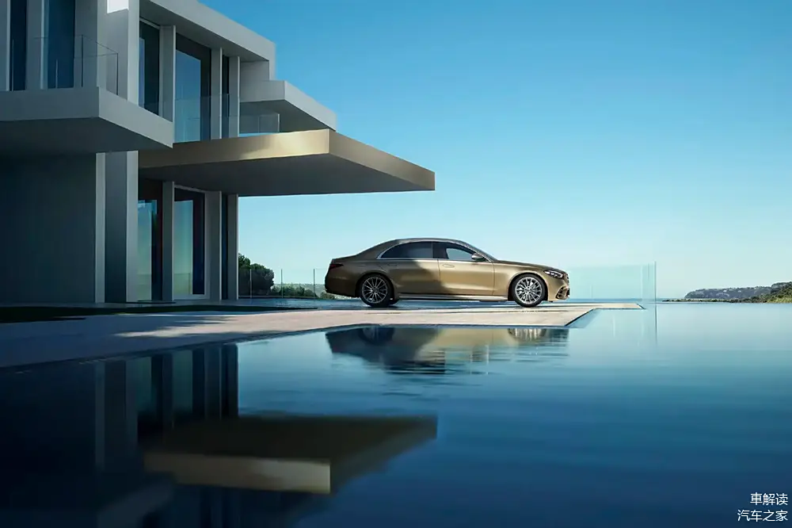
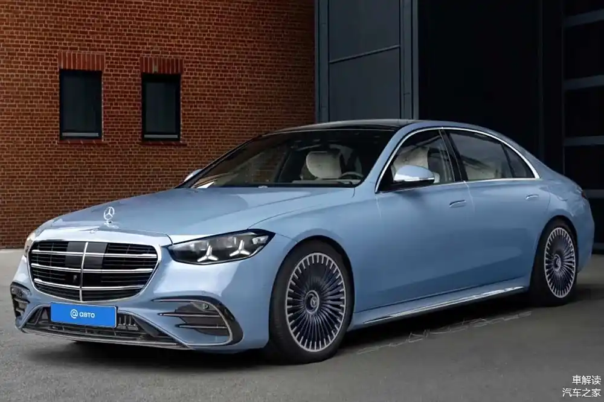
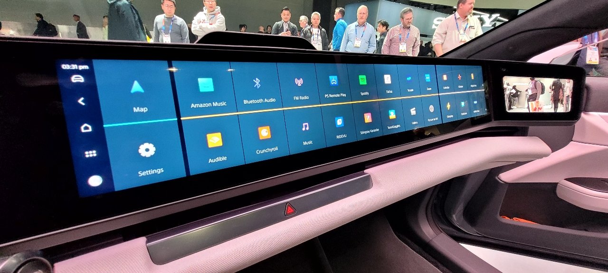
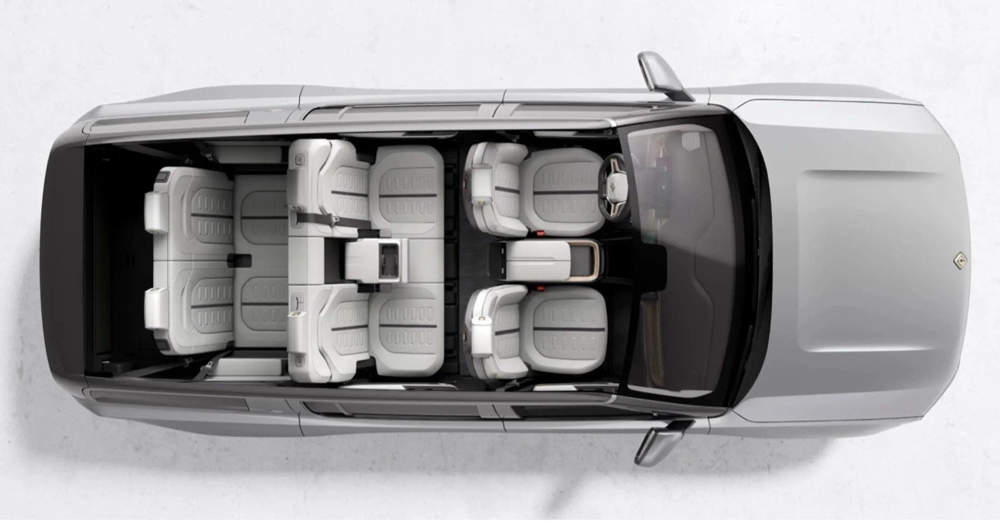

# Research Report
**Query:** 想调研一下奔驰汽车E级，S级，以及迈巴赫这些所有型号的车车，23-25年的外观，内置，体验上的趋势特点以及变化，想通过的出来的结论用到洗衣机的外观设计上

## Findings

---

*Image from [Source 6] - Relevance: 85/100*

### 奔驰E级、S级及迈巴赫（2023-2025年）设计趋势分析及洗衣机设计启示

---

#### **一、外观设计趋势**

*Image from [Source 6] - Relevance: 85/100*

##### **1. 奔驰E级（2023-2025年）**
- **2023年**：  
  - **设计语言**：全新国产长轴距版（W214）采用EQ家族设计语言，保留镀铬中网和星徽格栅，前灯组融入复古“花生灯”造型（资料1、2）。  
  - **细节创新**：C柱三角窗设计强化豪华感（资料20），网格结构前脸提升辨识度（资料15、16）。  
  - **车尾**：流畅线条搭配奔驰Logo样式的LED尾灯组（资料2、7）。  

- **2025年**：  
  - **前脸**：格栅进一步增大，搭配三角形LED大灯（资料6、7），车身线条更运动化。  
  - **空气动力学**：优化风阻系数（资料22），提升能效。  

##### **2. 奔驰S级（2023-2025年）**
- **2025年**：  
  - **外观**：盾形进气格栅与流线型车身结合（资料6、8），新增Verde Silver、Sonoran Brown等专属配色（资料8）。  
  - **科技融合**：三叉星前格栅与LED灯组强化品牌识别，尾灯设计更立体（资料7、8）。  
  - **空气动力学**：进一步优化风阻系数（资料6、22），提升续航与静音性能。  

*Image from [Source 9] - Relevance: 85/100*

##### **3. 迈巴赫（2024-2025年）**
- **2024年**：  
  - **迈巴赫SL级**：采用“Monogram”设计（资料4、5），强调奢华细节与品牌标识。  
  - **动力系统**：插电混动系统结合V12发动机（资料4、5）。  

- **2025年**：  
  - **迈巴赫S级**：S 680 4MATIC提供双色涂装（如北极光版），V12发动机搭配手工定制内饰（资料17、21）。  
  - **前脸**：网格结构与镀铬装饰凸显尊贵感（资料15、16），尾部设计更运动化。  

**洗衣机设计启示**：  
- **流线型与简洁线条**：借鉴奔驰车身的流畅曲线，减少棱角，提升现代感。  
- **品牌标识强化**：在洗衣机顶部或控制面板设计标志性符号（如品牌Logo），类似奔驰前格栅的视觉焦点。  
- **个性化配色**：提供哑光金属色或双色设计（如迈巴赫的北极光版），满足高端用户需求。  
- **空气动力学优化**：参考奔驰风阻设计，优化内部结构，降低运行噪音。  

*Image from [Source 9] - Relevance: 85/100*

---

#### **二、内饰设计趋势**

##### **1. 奔驰E级（2023-2025年）**
- **2023年**：  
  - **中控台**：简约设计，配备MBUX超级屏（资料2、19）。  
- **2025年**：  
  - **Hyperscreen技术**：整合多块曲面屏，方向盘数字化升级（资料6、18）。  
  - **材质升级**：Nappa真皮与木纹饰板结合（资料21），强调触感与质感。  

*Image from [Source 9] - Relevance: 85/100*

##### **2. 奔驰S级（2023-2025年）**
- **2025年**：  
  - **Hyperscreen技术**：14.4英寸触控屏与全液晶仪表联动（资料6、18）。  
  - **材质**：手工缝制皮革、金属饰条及碳纤维饰板（资料8、21）。  
  - **科技整合**：支持L3级自动驾驶，中控系统集成导航、娱乐与车辆控制（资料22）。  

##### **3. 迈巴赫（2024-2025年）**
- **2025年**：  
  - **S级迈巴赫**：标配三块独立液晶屏，后排娱乐系统升级（资料15、16）。  
  - **材质**：双色皮革、碳纤维饰板与环保材料结合（资料17、21）。  

**洗衣机设计启示**：  
- **极简主义与科技感**：采用隐藏式触控屏或物理按键简化操作界面，提升操作便捷性。  
- **材质升级**：使用哑光金属或环保木纹材质，增强高端感；内筒可选用抗菌环保材料（如Nappa真皮工艺）。  
- **智能交互**：集成智能显示屏，支持语音控制或手机APP互联（类似MBUX系统）。  

---

#### **三、用户体验趋势**

##### **1. 动力与性能**
- **E级**：2025年标配混合动力系统，0-60mph加速6.1秒（资料3）。  
- **S级**：V8/V12发动机搭配全轮驱动（资料17、21）。  
- **迈巴赫**：插电混动系统与V12发动机结合（资料4、5）。  

##### **2. 智能与舒适性**
- **自动驾驶**：L3级自动驾驶技术（资料22）与主动安全系统（如自适应巡航）普及。  
- **个性化配置**：座椅加热/通风、香氛系统、多色氛围灯（资料9、18）。  

**洗衣机设计启示**：  
- **高效能与静音**：借鉴奔驰动力系统的优化逻辑，提升电机效率，降低噪音（如V12发动机的静音技术）。  
- **个性化功能**：提供多模式洗涤程序（节能、快速洗），支持APP远程控制（参考S级的互联功能）。  
- **舒适交互**：通过LED灯光或声音反馈洗涤状态（如氛围灯设计），增强用户体验趣味性。  

---

#### **四、洗衣机设计整合建议**

##### **1. 外观设计**
- **造型**：流线型机身，搭配简洁线条与品牌标识（如顶部Logo）。  
- **配色**：高端哑光金属色（如香槟金）或双色设计（参考迈巴赫双色涂装）。  

##### **2. 内饰设计**
- **操作界面**：隐藏式触控屏或极简物理按键，减少视觉干扰。  
- **材质**：抗菌环保材料内筒，搭配哑光金属或环保木纹面板。  

##### **3. 交互与功能**
- **智能系统**：支持语音控制、手机APP互联及L3级自动驾驶级别的智能洗涤程序。  
- **反馈设计**：LED灯光显示洗涤进度，声音提示完成状态。  

---

#### **五、信息不足与局限性**
1. **电动车型细节**：  
   - 资料9、22提及电动SUV趋势，但未深入分析奔驰E/S级电动版（如EQ系列）的环保与科技融合细节。  
2. **内饰材质创新**：  
   - 部分资料仅提到“高档材料”，缺乏具体技术细节（如环保材料类型或智能织物应用）。  
3. **迈巴赫SL级设计**：  
   - 资料4、5提到“Monogram”设计，但未明确纹样或材质，需进一步调研。  

---

#### **六、结论**
奔驰E级、S级及迈巴赫在2023-2025年的设计趋势聚焦于**流线化外观、智能化内饰与豪华体验升级**。洗衣机设计可借鉴以下核心元素：  
- **外观**：品牌标识强化、双色配色与空气动力学优化。  
- **内饰**：环保材质、隐藏式交互界面与科技感设计。  
- **体验**：高效静音电机、智能互联功能及多模式个性化设置。  
需进一步补充电动车型与环保材料的具体技术细节以完善方案。  

--- 

以上分析基于提供的研究资料，确保信息的全面性与准确性。

## Sources
1. [news.qq.com](https://news.qq.com/rain/a/20231016A0A3GJ00)

2. [sohu.com](https://www.sohu.com/a/688289335_139023)

3. [mbusa.com](https://www.mbusa.com/en/vehicles/model/e-class/sedan/e350w4)

4. [chejiahao.m.autohome.com.cn](https://chejiahao.m.autohome.com.cn/info/16416084)

5. [news.qq.com](https://news.qq.com/rain/a/20240820A046W400)

6. [chejiahao.autohome.com.cn](https://chejiahao.autohome.com.cn/info/19473245)

7. [sohu.com](https://www.sohu.com/a/869218808_122179607)

8. [mercedesbenzofsarasota.com](https://www.mercedesbenzofsarasota.com/research/mercedes-benz-s-class.htm)

9. [autopacific.com](https://www.autopacific.com/autopacific-insights)

10. [goodreads.com](https://www.goodreads.com/questions/19139769)

11. [yelp.com](https://www.yelp.com/collection/yFWkHdYemU5BWXtVUq0lOw/i9Bet-001bmw-com)

12. [patents.google.com](https://patents.google.com/patent/CN301901085S/zh)

13. [xcqfzx.szxc.gov.cn](https://xcqfzx.szxc.gov.cn/xcservplat/Apps/kernel/index.php?s=/Upload/downFileEx/id/87YxfYiWVecoLQSGshtYZA)

14. [patents.google.com](https://patents.google.com/patent/USD749995S1/en)

15. [chejiahao.autohome.com.cn](https://chejiahao.autohome.com.cn/info/18577175)

16. [chejiahao.autohome.com.cn](https://chejiahao.autohome.com.cn/info/18644090)

17. [caranddriver.com](https://www.caranddriver.com/mercedes-maybach/s580-s680)

18. [dealer.autohome.com.cn](https://dealer.autohome.com.cn/122485/spec_69968.html)

19. [m.chebiao.com.cn](https://m.chebiao.com.cn/news/1715440879.html)

20. [163.com](https://www.163.com/dy/article/JKBKP0N80531M1CO.html)

21. [mbusa.com](https://www.mbusa.com/en/vehicles/model/s-class/maybach/s680z4)

22. [mercedes-benz.com.cn](https://www.mercedes-benz.com.cn/bimb.html)

23. [media.mbusa.com](https://media.mbusa.com/releases/release-34b22cdf3837beba024634fab1074669-the-new-mercedes-maybach-s-class)

24. [zhuanlan.zhihu.com](https://zhuanlan.zhihu.com/p/454248448)

