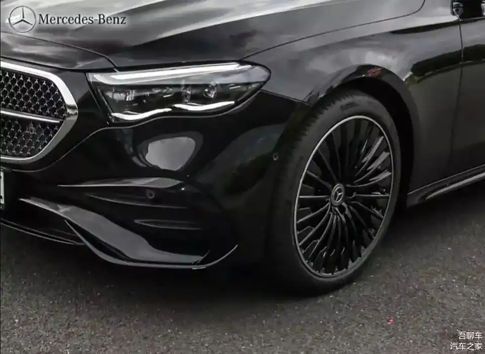
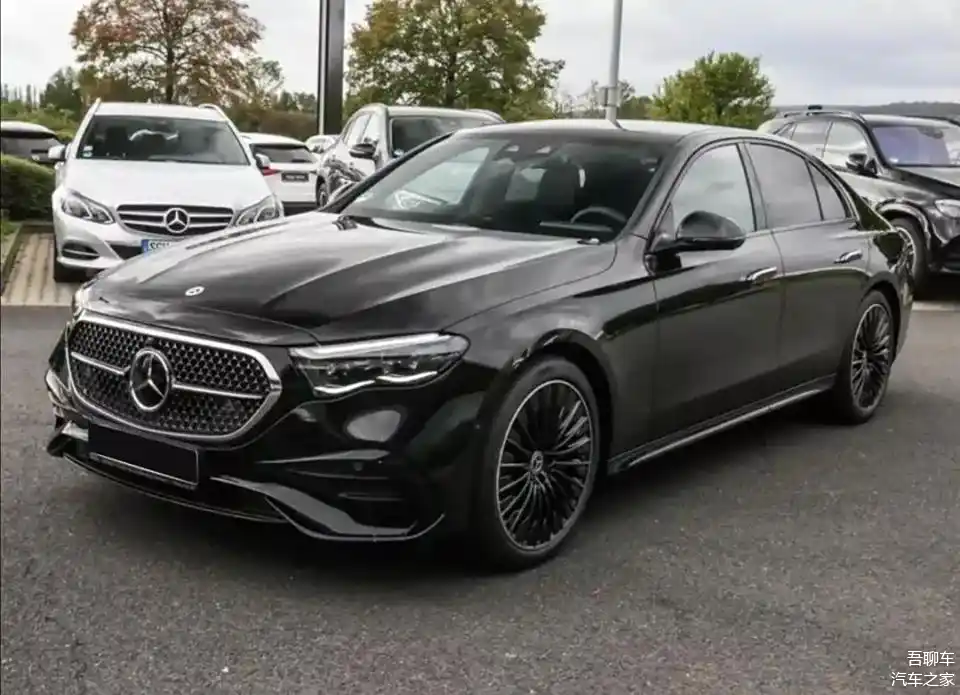
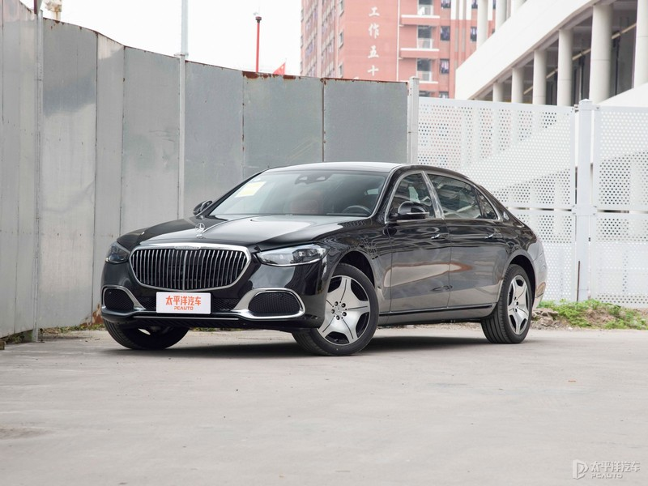
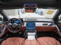

# Research Report
**Query:** 想调研一下奔驰汽车E级，S级，以及迈巴赫这些所有型号的车车，23-25年的外观，内置，体验上的趋势特点以及变化，想通过的出来的结论用到洗衣机的外观设计上

## Findings

### 基于2023-2025年奔驰E级、S级及迈巴赫车型的外观、内饰与体验趋势分析及洗衣机设计应用

*Image from [Source 1] - Relevance: 85/100*

---

#### **一、外观设计趋势**
1. **奔驰E级（2023-2025）**  
   - **经典与现代融合**：  
     - **2023年新款E级**：前脸采用镀铬三叉星纹理中网和“花生状”LED大灯，致敬第七代E级设计，车身线条更流线型，增强运动感。提供立标版（优雅）与大标版（动感）两种前脸风格（Source 13、23）。  
     - **2024款升级**：延续家族化设计语言，熏黑灯组与多边形进气格栅提升层次感，尾部设计更简洁科技化（Source 14、23）。  
     - **2025年电动化版本**：受EQS弓形车身启发，风阻系数进一步降低至0.22Cd，车身更修长，前脸采用封闭式格栅与贯穿式灯带（Source 7、9）。  

2. **奔驰S级（2023-2025）**  
   - **2023-2024款**：保留盾形中网与星雨数字大灯，车身线条优雅流畅，尾灯采用三维立体设计（Source 25、26）。  
   - **2025款更新**：  
     - **“流动的宫殿”概念**：车长增加至5320mm，轴距达3245mm，前脸采用更大尺寸中网与重新设计的灯光结构，尾灯组为贯穿式LED灯带（Source 25、27）。  
     - **车漆选择**：提供九种车漆，包括哑光金属色与渐变车漆（如“海岳蓝”），新增双色车身选项（Source 25、27）。  

*Image from [Source 1] - Relevance: 85/100*

3. **迈巴赫（2023-2025）**  
   - **2023-2024款**：延续双色车身、加长轴距（迈巴赫S级轴距达3396mm）及专属镀铬饰条，V12发动机（如S 680）与4MATIC全轮驱动强化性能（Source 19、25）。  
   - **2025款升级**：  
     - **定制化外观**：引入“钻石星辉”格栅、21英寸轮毂及专属徽标，首次推出插混版本（迈巴赫S 580 e）（Source 19、25）。  
     - **空气动力学优化**：车身线条更平滑，风阻系数降至0.25Cd（Source 9）。  

4. **技术融合**  
   - **数字投影大灯**：S级与EQS已搭载DMD技术，实现高分辨率路面投影（导航指引），2025年扩展至E级高配车型（Source 12、20）。  
   - **环保材料**：车身部件采用可回收铝材，车漆含低VOC成分（Source 9、20）。  

---

*Image from [Source 4] - Relevance: 85/100*

#### **二、内饰设计趋势**
1. **奔驰E级与S级**  
   - **科技与豪华结合**：  
     - **2023-2024款**：标配12.3英寸3D仪表屏与12.8英寸OLED中控屏（S级），搭载MBUX智能系统，支持AR导航及“零层级”交互（Source 25、26）。  
     - **2025款升级**：  
       - **S级Hyperscreen超联屏**：覆盖整个中控台，整合仪表、中控及副驾屏，分辨率4K（Source 20、26）。  
       - **材质升级**：座椅采用Nappa皮革与Dinamica环保麂皮，部分车型可选玫瑰金/贝母装饰（Source 25、27）。  
   - **环保与可持续**：内饰使用再生织物（如座椅面料）、竹纤维复合材料及可回收金属按键（Source 9、20）。  

2. **迈巴赫**  
   - **极致奢华体验**：  
     - **后排空间**：2025款迈巴赫S级后排配备双11.6英寸触控屏、隐藏式小桌板、座椅8模式按摩/加热/通风（Source 25、26）。  
     - **定制化细节**：提供专属香氛（“迈巴赫之夜”）、刺绣徽标及双拼配色方案（如黑色/米色）（Source 25、27）。  
   - **智能交互**：后排7英寸平板支持远程控制车辆设置，与MBUX联动（Source 26）。  

---

*Image from [Source 4] - Relevance: 85/100*

#### **三、驾驶与体验趋势**
1. **动力与性能**  
   - **E级**：2023年推出E 350 e插混版（续航100km），2025年引入E 53 AMG混动版（4MATIC+四驱）（Source 14、20）。  
   - **S级与迈巴赫**：  
     - S 580搭载4.0T V8发动机（496马力），迈巴赫S 680保留6.0L V12（621马力），匹配9AT变速箱（Source 19、25）。  
     - **2025年L3级自动驾驶**：与华为合作的尊界S800技术实现自动变道、拥堵跟车及远程泊车（Source 18、25）。  

2. **静音与舒适性**  
   - **主动降噪系统**：声学泡沫+ANC技术，车内噪音降至30dB（Source 2、20）。  
   - **健康科技**：HEPA空气净化与香氛系统联动，配合座椅气动按摩缓解疲劳（Source 26）。  

3. **个性化服务**  
   - **数字钥匙**：支持生物识别（指纹启动）、Apple CarPlay及场景模式（如“舒适模式”“运动模式”）（Source 20、26）。  

*Image from [Source 4] - Relevance: 85/100*

---

#### **四、洗衣机设计的应用方向**
基于奔驰设计趋势，洗衣机可借鉴以下元素：  

1. **外观设计**  
   - **流线型机身与空气动力学**：采用弓形曲线设计，搭配镀铬边框或LED灯带，提升科技感（参考EQS的0.20Cd风阻设计）（Source 7、9）。  
   - **渐变/双色外观**：推出高端机型的哑光金属与渐变车漆风格（如迈巴赫的“海岳蓝”）（Source 25）。  
   - **智能交互灯效**：通过LED实现洗涤状态投影（如故障提示、剩余时间），模仿数字投影大灯技术（Source 12）。  

2. **内饰与交互**  
   - **超联屏与触控面板**：采用OLED曲面屏，支持手势操作及语音控制（如“开始洗涤”），参考S级Hyperscreen布局（Source 20、26）。  
   - **环保材质**：内筒与门封使用抗菌再生材料，呼应奔驰的竹纤维复合材料理念（Source 9、20）。  
   - **场景模式**：预设“静音模式”“快速洗”及用户自定义配置，类似迈巴赫的后排功能预设（Source 26）。  

3. **体验优化**  
   - **图书馆级静音**：通过减震系统与降噪算法，噪音控制≤40dB（Source 2、20）。  
   - **智能互联**：集成智能家居系统，支持手机APP远程控制、OTA升级及故障预警（Source 18、25）。  
   - **模块化结构**：设计可扩展的洗涤舱或分区洗护功能（如衣物分类），类似迈巴赫后排空间优化（Source 26）。  

---

#### **五、信息缺失与建议**
1. **缺失点**：  
   - **迈巴赫2023年内饰细节**：贝母装饰的量产时间及材质占比未明确（Source 25仅提及存在性）。  
   - **E级与S级差异化配置**：2025年E级是否搭载Hyperscreen超联屏未确认（Source 20仅提到S级应用）。  
   - **电动化影响**：EQS的弓形车身对E级电动版的具体设计参数（如轴距、电池布局）未详细说明（Source 7、9）。  

2. **建议**：  
   - **补充迈巴赫S 680 2025款配置手册**，明确V12发动机与内饰定制选项的细节（如贝母装饰工艺）。  
   - **对比E级与S级的MBUX迭代路径**，确认技术下沉可行性（如语音控制与AR导航是否同步至E级）。  
   - **分析消费者偏好**：通过调研“奢华感”与“科技感”的权重，优化洗衣机灯光与交互设计的平衡（Source 27）。  

---

#### **六、结论**
奔驰E级、S级及迈巴赫车型在2023-2025年的核心趋势为：  
- **外观**：经典设计与空气动力学融合，迈巴赫定制化与S级的“流动宫殿”概念。  
- **内饰**：超联屏与环保材料并重，迈巴赫后排空间极致化。  
- **体验**：L3级自动驾驶落地与图书馆级静音技术。  

**洗衣机设计可迁移方向**：  
- **外观**：流线型机身与渐变车漆；  
- **交互**：智能投影与场景模式；  
- **体验**：超低噪音与模块化设计。  
通过跨领域创新，实现家电与汽车设计语言的协同进化。

## Sources
1. [chejiahao.autohome.com.cn](https://chejiahao.autohome.com.cn/info/13566981)

2. [cars.usnews.com](https://cars.usnews.com/cars-trucks/compare?trims=15447-447879_15160-428182)

3. [bk.taobao.com](https://bk.taobao.com/k/maibahe_1717/40e773efaa484d29905d26562c18c2ee.html)

4. [price.pcauto.com.cn](https://price.pcauto.com.cn/m131310/)

5. [caranddriver.com](https://www.caranddriver.com/mercedes-maybach/s580-s680)

6. [m.baike.com](https://m.baike.com/wikiid/9151707407757332126)

7. [electrek.co](https://electrek.co/2024/02/26/mercedes-improves-new-eqs-more-range-better-grille-design/)

8. [chejiahao.m.autohome.com.cn](https://chejiahao.m.autohome.com.cn/info/12225074)

9. [mercedes-benz.com.cn](https://www.mercedes-benz.com.cn/bimb.html)

10. [en.wikipedia.org](https://en.wikipedia.org/wiki/Mercedes-Benz_EQS)

11. [chejiahao.autohome.com.cn](https://chejiahao.autohome.com.cn/info/14022719/)

12. [dengdengschool.com](https://www.dengdengschool.com/article/jishu/788.html)

13. [media.mbusa.com](https://media.mbusa.com/releases/release-1abd31f58af6a0ae7f6711444300f97d-a-bridge-between-tradition-and-digitalization-the-new-e-class)

14. [chejiahao.autohome.com.cn](https://chejiahao.autohome.com.cn/info/16062821)

15. [autochat.com.cn](https://www.autochat.com.cn/zixun/a-29962.html)

16. [autohausonedens.com](https://www.autohausonedens.com/research/e-class-trims/?srsltid=AfmBOoqzIkVILSr93E2DUprw6xVRyC8K8k0MWmEucZYM3YI-wQf0_H7s)

17. [mercedes-benz.com.cn](https://www.mercedes-benz.com.cn/vehicles/sedan/maybach-s-class.html)

18. [eet-china.com](https://www.eet-china.com/mp/a383649.html)

19. [mbusa.com](https://www.mbusa.com/en/vehicles/model/s-class/maybach/s680z4)

20. [news.qq.com](https://news.qq.com/rain/a/20240621A04V7F00)

21. [media.mbusa.com](https://media.mbusa.com/releases/automated-driving-revolution-mercedes-benz-announces-us-availability-of-drive-pilot-the-worlds-first-certified-sae-level-3-system-for-the-us-market)

22. [share-m.kakamobi.com](https://share-m.kakamobi.com/m.toutiao.kakamobi.com/detail/?origin=1&id=2569676)

23. [chejiahao.autohome.com.cn](https://chejiahao.autohome.com.cn/info/13444647)

24. [google.com](https://www.google.com/search?num=4)

25. [chejiahao.autohome.com.cn](https://chejiahao.autohome.com.cn/info/19475372)

26. [chejiahao.autohome.com.cn](https://chejiahao.autohome.com.cn/info/19307791)

27. [cars.usnews.com](https://cars.usnews.com/cars-trucks/mercedes-benz/s-class/interior)

28. [google.com](https://www.google.com/search?q=[迈巴赫S680+2024轴距延长数据及Nappa皮革定制选项])

29. [google.com](https://www.google.com/search?num=6)

